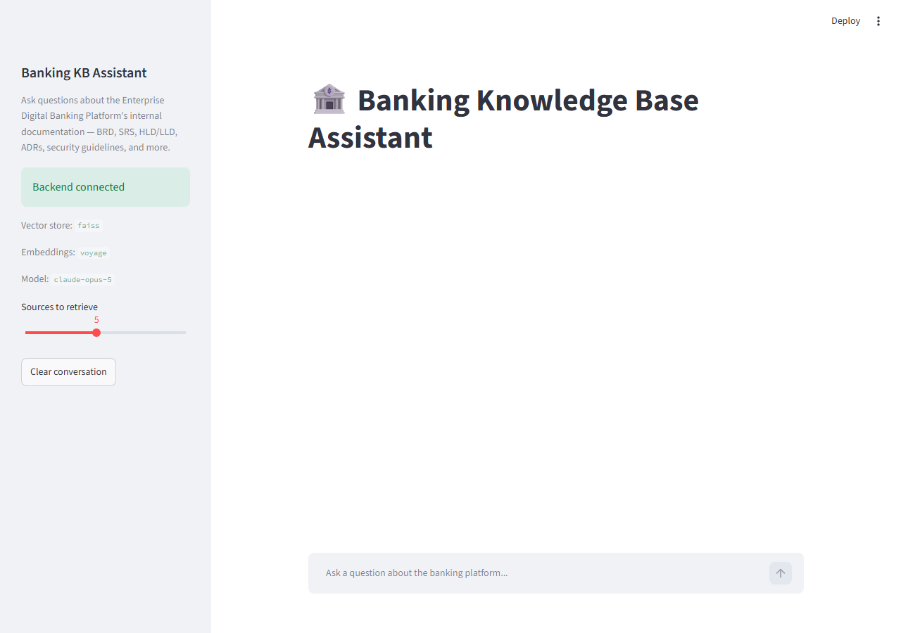
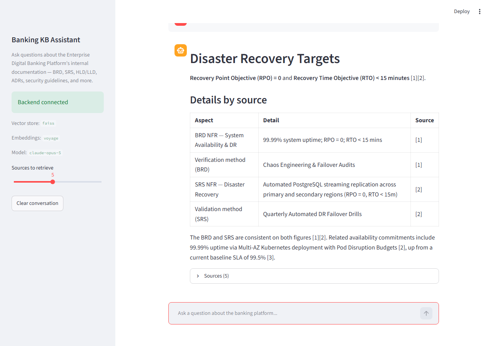
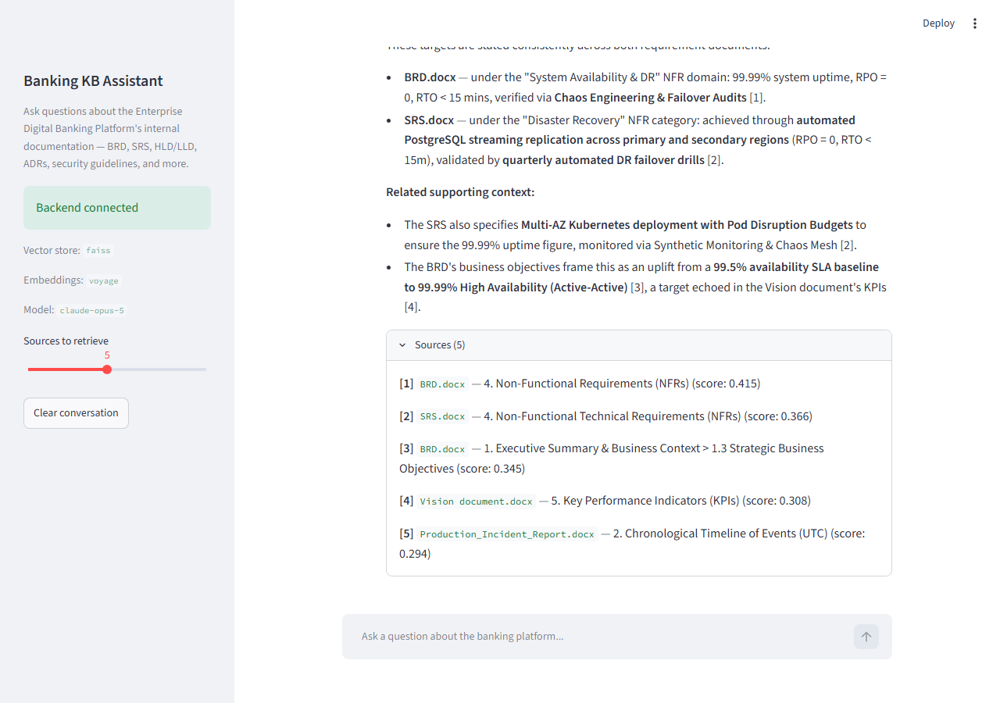

# Part 9: Streamlit Frontend

**Status:** Implemented.

## What it does

`app.py` is a Streamlit chat UI for end users. It is the only file in the
entire project that talks over HTTP to a separate process instead of
importing another part's module directly -- everything upstream (retrieval,
Claude, indexing) runs inside Part 8's FastAPI service. This app only knows
HTTP (`GET /health`, `POST /query`), so it never needs embedding, vector
store, or Claude credentials itself -- only `API_BASE_URL`.

- **Sidebar**: connection status (calls `/health` on load), the active
  vector store / embedding provider / Claude model, a "sources to retrieve"
  slider (`top_k`), and a clear-conversation button.
- **Main area**: a standard `st.chat_message` / `st.chat_input` conversation.
  Each assistant turn renders the answer plus a collapsible **Sources**
  expander listing citation number, source file, heading path, and
  similarity score -- pulled directly from Part 8's response, not
  re-derived.
- **Errors**: if the backend is unreachable, the sidebar shows which URL it
  tried and how to start the backend, and a failed `/query` call surfaces as
  an inline chat message rather than crashing the app.

## Files

| File | Purpose |
|---|---|
| `app.py` | The Streamlit app. Run via `streamlit run app.py`. |
| `screenshots/` | Screenshots from the live browser verification below. |

## Verification (real browser, not just code review)

Per this project's testing standard, this part was driven in an actual
headless-Chromium browser via Playwright, against the actual running FastAPI
backend (not mocked) -- the golden path end to end:

1. **Initial load** -- sidebar correctly reports "Backend connected" with
   `vector_store: faiss`, `embedding_provider: voyage`, `model: claude-opus-5`.

   

2. **Ask a real question** ("What are the disaster recovery RTO and RPO
   targets?") -- the answer renders as formatted markdown (a table, in this
   case) with inline citations, and a "Sources (5)" expander appears.

   

3. **Expand Sources** -- each citation shows its number, source file,
   heading path, and retrieval score, matching Part 8's `/query` response
   exactly.

   

Browser console was checked for errors after the answer rendered -- none.

## Usage

```bash
# Terminal 1: start the backend (from 3Day_mod/, with the Part 1 venv active)
python Part8_FastAPI_Backend/main.py

# Terminal 2: start the frontend
streamlit run Part9_Streamlit_Frontend/app.py
```

Streamlit opens at `http://localhost:8501` by default. If the backend runs
on a different host/port, set `API_BASE_URL` in `shared/.env` (defaults to
`http://localhost:8000`).

## Next step

Proceed to [Part 10: Docker, Deployment, and Testing](../Part10_Docker_Deployment/README.md),
which will containerize both this app and Part 8's backend and add an
end-to-end test suite.
